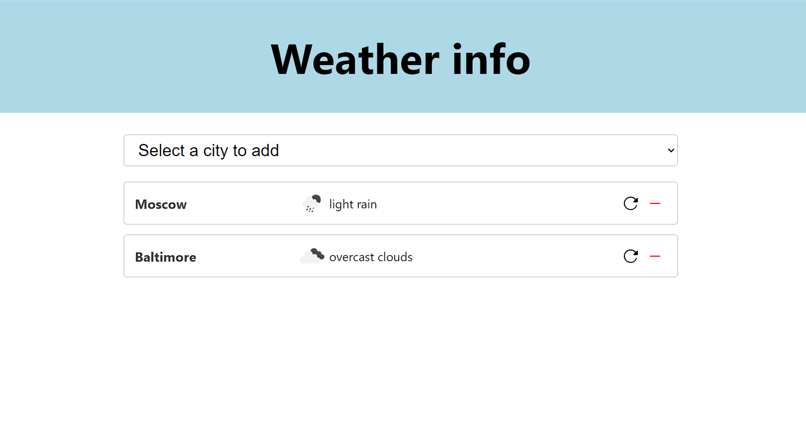

## Belka task to evaluate basic react skills
**Using react+redux get weather info from openweathermap for a static list of cities**

*Complete instructions found at
https://github.com/BelkaLab/weather-info-exercise-ts*
